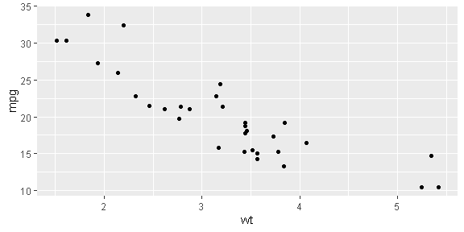

## What is R?

[Link for more information](https://www.r-project.org/about.html)

R is a language and environment for statistical computing and graphics. It is a [GNU project](https://www.gnu.org/) which is similar to the S language and environment which was developed at **Bell Laboratories** (formerly AT&T, now Lucent Technologies) by *John Chambers* and colleagues. R can be considered as a different implementation of S. There are some important differences, but much code written for S runs unaltered under R.

## What is R?

R provides a wide variety of statistical (linear and nonlinear modelling, classical statistical tests, time-series analysis, classification, clustering, …) and graphical techniques, and is highly extensible. The S language is often the vehicle of choice for research in statistical methodology, and R provides an Open Source route to participation in that activity.

## What is R?

One of R’s strengths is the ease with which well-designed publication-quality plots can be produced, including mathematical symbols and formulae where needed. Great care has been taken over the defaults for the minor design choices in graphics, but the user retains full control.

## What is R?

R is available as Free Software under the terms of the **Free Software Foundation’s** [GNU General Public License](https://www.r-project.org/COPYING) in source code form. It compiles and runs on a wide variety of UNIX platforms and similar systems (including FreeBSD and Linux), Windows and MacOS.

## The R environment

R is an integrated suite of software facilities for data manipulation, calculation and graphical display. It includes

  - an effective data handling and storage facility,
  - a suite of operators for calculations on arrays, in particular matrices,
  - a large, coherent, integrated collection of intermediate tools for data analysis,
  
## The R environment

  - graphical facilities for data analysis and display either on-screen or on hardcopy, and
  - a well-developed, simple and effective programming language which includes conditionals, loops, user-defined recursive functions and input and output facilities.
  
## The R environment

The term “environment” is intended to characterize it as a fully planned and coherent system, rather than an incremental accretion of very specific and inflexible tools, as is frequently the case with other data analysis software.

## The R environment

R, like S, is designed around a true computer language, and it allows users to add additional functionality by defining new functions. Much of the system is itself written in the R dialect of S, which makes it easy for users to follow the algorithmic choices  made. For computationally-intensive tasks, C, C++ and Fortran code can be linked and called at run time. Advanced users can write C code to manipulate R objects directly.

## The R environment

Many users think of R as a statistics system. We prefer to think of it as an environment within which statistical techniques are implemented. R can be extended (easily) via packages. There are about eight packages supplied with the R distribution and many more are available through the CRAN family of Internet sites covering a very wide range of modern statistics.

## The R environment

R has its own LaTeX-like documentation format, which is used to supply comprehensive documentation, both on-line in a number of formats and in hardcopy.


## Download and Install R

[Link: The Comprehensive R Archive Network](https://brieger.esalq.usp.br/CRAN/)

Precompiled binary distributions of the base system and contributed packages, Windows and Mac users most likely want one of these versions of R:
  - Download R for Linux (Debian, Fedora/Redhat, Ubuntu)
  - Download R for macOS
  - Download R for Windows
R is part of many Linux distributions, you should check with your Linux package management system in addition to the link above.

## RStudio 

Used by millions of people weekly, the **RStudio integrated development environment (IDE)** is a set of tools built to help you be more productive with **R and Python**.

## Download RStudio Desktop

[link: RStudio Desktop](https://posit.co/download/rstudio-desktop/)

## Install Packages from Repositories or Local Files


```r
install.packages("tidyverse")
```

## Loading/Attaching and Listing of Packages


```r
library(tidyverse)
citation("tidyverse")
```

## List Objects (ggplot2 example)


```r
ls("package:ggplot2")
citation("ggplot2")
```


## Example of dplyr R package


```r
library(dplyr)
starwars %>% 
  select(homeworld, height, mass) 
```

## Example of ggplot2 R package 


```r
library(ggplot2)
ggplot(mtcars, aes(wt, mpg)) + 
  geom_point()
```

<!-- -->

## Rmarkdown from Rstudio

  - Documents
  - Interactive Documents
  - Dashboards
  - Presentations
  - Books
  - Websites
  - Templates
  - Package Vignettes

## Rmarkdown from Rstudio: Examples

[Check out the range of outputs and formats you can create using R Markdown](https://rmarkdown.rstudio.com/gallery)


## Citation R

To cite R in publications use:

  > R Core Team (2022). R: A language and environment for statistical computing. R Foundation for Statistical Computing, Vienna, Austria. URL https://www.R-project.org/.


## References: Books

  1) [ggplot2: elegant graphics for data analysis,  Hadley Wickham](https://ggplot2-book.org/)

  2) [R Programming for Data Science, Roger D. Peng](https://bookdown.org/rdpeng/rprogdatascience/)

  3) [R for Data Science, Hadley Wickham e Garrett Grolemund.](https://r4ds.had.co.nz/)

  4) [R Graphics Cookbook, Winston Chang](https://r-graphics.org/)

## References (links do dplyr, ggplot2 e magrittr) 

  1) [Link: dplyr do tidyverse](https://dplyr.tidyverse.org/)

  2) [Link: ggplot2 do tidyverse](https://ggplot2.tidyverse.org/)

  3) [Link: magrittr do tidyverse?](https://magrittr.tidyverse.org/)

## Reference: cheat sheet

  1) [Link Data visualization with ggplot2](https://github.com/rstudio/cheatsheets/blob/main/data-visualization.pdf)

  2) [Link Data transformation with dplyr](https://github.com/rstudio/cheatsheets/blob/main/data-transformation.pdf)

  3) [Link Rmarkdown](https://github.com/rstudio/cheatsheets/blob/main/rmarkdown.pdf)

  4) [Link Rstudio IDE](https://github.com/rstudio/cheatsheets/blob/main/rstudio-ide.pdf)


